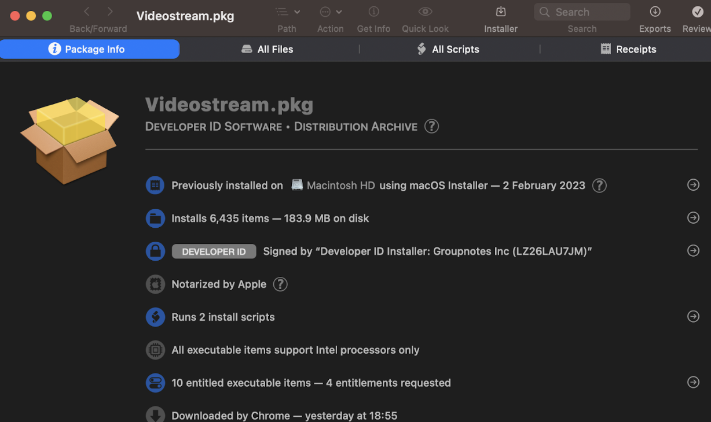

# Background

Videostream is a wireless application that streams video, music, and image files to Google's Chromecast. It claims to be the simplest and most reliable method of streaming videos to your Chromecast, allowing you to play any local video file wirelessly with just one click. The application transcodes audio and video of non-compatible files into a format supported by Chromecast. 

Videostream app has been installed in more than 5,000,000 devices. The numbers were taken from their website (https://getvideostream.com), when only in the Chrome app store it states 900,000+ users.

# Preface

This document will focus on the local privilege escalation vulnerability on macOS Videostream app, and will both include the steps that were taken to detect the vulnerability and the writing of the exploit that abuses it to gain local privilege escalation.

The vulnerability abuses the update mechanism of Videostream, and allows an attacker to instruct the installer to extract a malicious `tar.gz` instead of the original one that was initially downloaded. 

I also had to find a way to trigger the download mechanism and the update flow. As the script will only install the package if there is a newer version released in Videostream’s website than what is currently installed.

In the following section we will go over the analysis phase, at the next sections we’ll write a working exploit that gains local privilege escalation.

# Initial Research

We can download the macOS installation file (.pkg) from the Videostream website (https://getvideostream.com). We could use the "Suspicious Package" app (https://mothersruin.com/software/SuspiciousPackage/) to view the contents and scripts of the package before installation. This will give us a preview of what will happen during installation.

